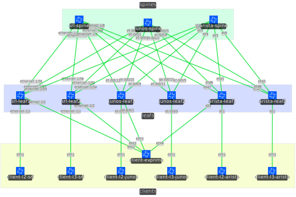

# SR Linux <-> Multivendor EVPN-VXLAN Lab
## Lab Description

This lab demonstrates EVPN-VXLAN interop between three vendors: Nokia, Juniper and Arista, using their SR Linux, Junos Evolved and EOS NOSes respectively.
The aim was to give a "Rosetta Stone" to translate between diffent vendors' configuration syntaxes, and to allow experimentation with EVPN-VXLAN vendor interoperability.

## Physical Topology



The datacenter network topology consists of 2 leafs and 1 spine for each vendor, connected in a Clos topology.  
Connected to the leaf switches are one client each, and a shared client used to demonstrate EVPN multihoming.

## Logical Topology

### Fabric

This lab demonstrates 3 different types of fabrics -- eBGP-only, eBGP underlay with iBGP overlay, and eBGP underlay with eBGP overlay.  
The type of fabric deployed can be adjusted at deployment time.

All inter-switch links between spine and leaf switches are only numbered using IPv6 link-local addresses, with IPv6 Router Advertisements enabled.
[eBGP Unnumbered](https://datatracker.ietf.org/doc/html/draft-white-linklocal-capability-06) (also called "Interface BGP") sessions are established through the inter-switch links via their IPv6 link-local addresses, router advertisements used as method of BGP neighbor discovery.  

The VTEPs, which source their IPv4 addresses from loopback interfaces, are reachable through IPv6 next-hops ([RFC8950 aka RFC5549](https://www.rfc-editor.org/rfc/rfc8950.html)).

All leaf switches have a unique ASN (65001-), and all spine switches have the same ASN (65000). Using this ASN configuration enforces "valley-free routing", as any route that transits more than 1 spine switch is automatically considered invalid due to the BGP AS Path loop prevention mechanism.

#### eBGP-iBGP Fabric

The eBGP unnumbered underlay distributes the loopback addresses in the IPv4 AFI, which has IPv6 next-hops enabled. The iBGP overlay (using AS 65534), which has the EVPN AFI enabled, is not a full mesh, but rather **every spine is a route reflector** (cluster ID 10.0.0.10), this is to improve scaling and to lessen configuration burden.

#### eBGP-eBGP Fabric

Similarly to the eBGP-iBGP Fabric, the eBGP unnumbered underlay only distributes the loopbacks, and the eBGP overlay (using the same AS numbers as the underlay) is established between spine and leaf loopbacks. Spines act as "pseudo" route reflectors in that they do not modify the next-hop of overlay routes, which, in the case of the EVPN address family, is the VTEP address. 

#### eBGP-only Fabric

The eBGP-only fabric carries all address families in the same eBGP Unnumbered session using MP-BGP, simplifying operations.

> [!WARNING]  
> The eBGP-only fabric is currently only working on SR Linux and Arista EOS.

### Services

There are four different types of EVPN services deployed as part of the test topology:
- A bridged L2 EVPN instance, on **VNI 10010**.  
  Clients are `client-l2`, connected to the leaf switches via `eth1` tagged VLAN 10.  
  The clients are addressed as:
  * `client-l2-srl`: 192.168.10.11/24
  * `client-l2-junos`: 192.168.10.12/24
  * `client-l2-arista`: 192.168.10.13/24
- An all-active EVPN ESI LAG, connected to a bridged L2 EVPN instance, on **VNI 10020**.  
  Clients are `client-l2`, connected to leaf switches via `eth1` tagged VLAN 20, and `client-evpnmh`, via `bond0` tagged VLAN 20.  
  The clients are addressed as:
  * `client-evpnmh`: 192.168.20.2/24
  * `client-l2-srl`: 192.168.20.11/24
  * `client-l2-junos`: 192.168.20.12/24
  * `client-l2-arista`: 192.168.20.13/24
- An RT5-only L3 EVPN instance, on **VNI 10100**.  
  Client are `client-l3`, connected to leaf switches via `eth1` tagged VLAN 100.  
  The client are addressed as:
  * `client-l3-srl`: 192.168.100.0/31
  * `client-l3-junos`: 192.168.100.2/31
  * `client-l3-arista`: 192.168.100.4/31
- A bridged L2 EVPN instance with an IRB anycast gateway, on **VNI 10200**.  
  Client are `client-l3`, connected to leaf switches via `eth1` tagged VLAN 200.  
  The client are addressed as:
  * Anycast gateway: 192.168.200.1/24
  * `client-l3-srl`: 192.168.200.11/24
  * `client-l3-junos`: 192.168.200.12/24
  * `client-l3-arista`: 192.168.200.13/24

## Requirements

### Host Requirements

The complete lab requires approximately **20 vCPUs and 32 GB RAM** to deploy and run.

If you are running this inside a virtual machine, make sure that nested virtualization is enabled both on the host PC and the virtualization software you are using, as vJunos-Evolved is run inside a VM.

A lean version of this lab that only requires approx. **8 vCPUs and 8 GB of RAM** can be achieved by commenting out all vJunos-related entries in the Containerlab topology file.  

> [!NOTE]  
> These requirements refer to _free_ resources on the host, not total.

### Software Requirements

A working installation of [Containerlab](https://containerlab.dev/install/) is required to deploy the lab. In case a working container runtime is not present on the host, the quick install script of Containerlab automatically performs the installation of Docker as well.

To perform the build of the vJunos-Evolved image using `vrnetlab`, a working Python3 install, `git` and `make` is also required.

### Images used in Topology

The images used in this lab topology are the following:
- `ghcr.io/nokia/srlinux:25.7`  
  Pullable from GitHub Container Registry without an account.
- `arista_ceos:4.33.4M`  
  Downloadable from the [Arista Support Portal](https://www.arista.com/en/support/software-download) (requires a free account), import container image with the command `docker import cEOS64-lab-4.33.4M.tar.xz arista_ceos:4.33.4M`.
- `vrnetlab/juniper_vjunosevolved:23.4R2-S2.1`  
  Downloadable from the [Juniper Support Portal](https://support.juniper.net/support/downloads/?p=vjunos-evolved) (no account required), build image using [`vrnetlab`](https://github.com/srl-labs/vrnetlab).
- `ghcr.io/srl-labs/network-multitool:latest`  
  Pullable from GitHub Container Registry without an account.

#### Building vJunos-Evolved with `vrnetlab`

To build the vJunos-Evolved container, first install the pre-requisites:

##### Debian/Ubuntu-based (APT)

```bash
apt update
apt install build-essential git python3-pip python3-venv
```

##### CentOS/Fedora-based (DNF)

```bash
dnf install make git python3-pip python3-venv
```

Clone the repository, enter the vjunosevolved directory and download the image:

```bash
git clone --depth=1 https://github.com/srl-labs/vrnetlab
cd vrnetlab/juniper/vjunosevolved
# Copy the URL the Juniper Support Portal gives you
wget "https://cdn.juniper.net/software/..." -O vJunosEvolved-23.4R2-S2.1.qcow2 
```

Finally, run `make` in the same directory to build the image.

Confirm that the image has been built successfully using the following command:

```bash
$ docker images vrnetlab/juniper_vjunosevolved
REPOSITORY                       TAG             IMAGE ID       CREATED         SIZE
vrnetlab/juniper_vjunosevolved   23.4R2-S2.1     73cd8c33b817   6 months ago    2.2GB
```

## Deploying the Lab

The choice of fabric can be set through the `FABRIC_TYPE` environment variable at deployment time, like so:

```bash
# Possible FABRIC_TYPEs are:
# - ebgp-only
# - ebgp-ibgp
# - ebgp-ebgp
$ FABRIC_TYPE=ebgp-ebgp containerlab deploy -t ./srl-multivendor-evpn.clab.yml
...
```

If the `FABRIC_TYPE` environment variable is not set, by default, an eBGP-iBGP fabric will be deployed.

The SR Linux and cEOS nodes should immediately be available once Containerlab finishes with the deployment. vJunos-Evolved nodes might take longer to boot, depending on hardware (up to 3-5 minutes).

## Working with the Lab

All nodes can be logged into via SSH. Here are the pre-configured credentials set by Containerlab:

SR Linux based nodes (`srl-leaf1, srl-leaf2, srl-spine`): `admin / NokiaSrl1!` (if your user has an SSH key on the host, or have SSH agent forwarding running, your public key should be automatically authorized)
Junos Evolved based nodes (`junos-leaf1, junos-leaf2, junos-spine`): `admin / admin@123`
Arista EOS based nodes (`arista-leaf1, arista-leaf2, arista-spine`): `admin / admin`
Client nodes (`client-*`): `user / multit00l`

### Checking Connectivity

There are two main ways to check working connectivity: via the clients or via the network itself.

#### Clients

To check connectivity on the clients, use `ping` or `iperf3`. Refer to the [Services](#services) section for an addressing plan.

#### SR Linux

Verify BGP connectivity to neighbors is established and routes are exchanged using the `show network-instance default protocols bgp neighbor` command:

```
--{ running }--[  ]--
A:admin@srl-leaf1# show network-instance default protocols bgp neighbor
-----------------------------------------------------------------------------------------------------------------------------------------------------------------------------------------
BGP neighbor summary for network-instance "default"
Flags: S static, D dynamic, L discovered by LLDP, B BFD enabled, - disabled, * slow
-----------------------------------------------------------------------------------------------------------------------------------------------------------------------------------------
-----------------------------------------------------------------------------------------------------------------------------------------------------------------------------------------
+--------------------+-----------------------------+--------------------+-------+-----------+----------------+----------------+--------------+-----------------------------+
|      Net-Inst      |            Peer             |       Group        | Flags |  Peer-AS  |     State      |     Uptime     |   AFI/SAFI   |       [Rx/Active/Tx]        |
+====================+=============================+====================+=======+===========+================+================+==============+=============================+
| default            | 10.0.0.11                   | overlay            | S     | 65534     | established    | 0d:16h:36m:41s | evpn         | [27/0/5]                    |
| default            | 10.0.0.12                   | overlay            | S     | 65534     | established    | 0d:16h:33m:31s | evpn         | [26/16/5]                   |
| default            | 10.0.0.13                   | overlay            | S     | 65534     | established    | 0d:16h:36m:12s | evpn         | [27/1/5]                    |
| default            | fe80::1801:fff:feff:1%ether | underlay           | DB    | 65000     | established    | 0d:16h:36m:47s | ipv4-unicast | [6/6/3]                     |
|                    | net-1/56.0                  |                    |       |           |                |                |              |                             |
| default            | fe80::a8c1:abff:fe3f:ba3b%e | underlay           | DB    | 65000     | established    | 0d:16h:36m:28s | ipv4-unicast | [6/6/8]                     |
|                    | thernet-1/54.0              |                    |       |           |                |                |              |                             |
| default            | fe80::aec3:3bff:fe78:ffff%e | underlay           | DB    | 65000     | established    | 0d:16h:33m:53s | ipv4-unicast | [6/6/8]                     |
|                    | thernet-1/55.0              |                    |       |           |                |                |              |                             |
+--------------------+-----------------------------+--------------------+-------+-----------+----------------+----------------+--------------+-----------------------------+
-----------------------------------------------------------------------------------------------------------------------------------------------------------------------------------------
```

Verify EVPN routes are exchanged; here, we check specifically for type 4 (Ethernet Segment) routes using the `show network-instance default protocols bgp routes evpn route-type 4 summary` command:

```
--{ running }--[  ]--
A:admin@srl-leaf1# show network-instance default protocols bgp routes evpn route-type 4 summary
-----------------------------------------------------------------------------------------------------------------------------------------------------------------------------------------
Show report for the BGP route table of network-instance "default"
-----------------------------------------------------------------------------------------------------------------------------------------------------------------------------------------
Status codes: u=used, *=valid, >=best, x=stale, b=backup, w=unused-weight-only
Origin codes: i=IGP, e=EGP, ?=incomplete
-----------------------------------------------------------------------------------------------------------------------------------------------------------------------------------------
BGP Router ID: 10.0.0.1      AS: 65001      Local AS: 65001
-----------------------------------------------------------------------------------------------------------------------------------------------------------------------------------------
Type 4 Ethernet Segment Routes
+--------+--------------------------------+--------------------------------+--------------------------------+--------------------------------+--------+--------------------------------+
| Status |      Route-distinguisher       |              ESI               |       originating-router       |            neighbor            | Path-  |            Next-Hop            |
|        |                                |                                |                                |                                |   id   |                                |
+========+================================+================================+================================+================================+========+================================+
| *      | 10.0.0.2:0                     | 00:24:24:24:24:24:24:00:00:20  | 10.0.0.2                       | 10.0.0.11                      | 0      | 10.0.0.2                       |
| u*>    | 10.0.0.2:0                     | 00:24:24:24:24:24:24:00:00:20  | 10.0.0.2                       | 10.0.0.13                      | 0      | 10.0.0.2                       |
| *      | 10.0.0.3:0                     | 00:24:24:24:24:24:24:00:00:20  | 10.0.0.3                       | 10.0.0.11                      | 0      | 10.0.0.3                       |
| u*>    | 10.0.0.3:0                     | 00:24:24:24:24:24:24:00:00:20  | 10.0.0.3                       | 10.0.0.12                      | 0      | 10.0.0.3                       |
| *      | 10.0.0.3:0                     | 00:24:24:24:24:24:24:00:00:20  | 10.0.0.3                       | 10.0.0.13                      | 0      | 10.0.0.3                       |
| *      | 10.0.0.5:1                     | 00:24:24:24:24:24:24:00:00:20  | 10.0.0.5                       | 10.0.0.11                      | 0      | 10.0.0.5                       |
| u*>    | 10.0.0.5:1                     | 00:24:24:24:24:24:24:00:00:20  | 10.0.0.5                       | 10.0.0.12                      | 0      | 10.0.0.5                       |
| *      | 10.0.0.5:1                     | 00:24:24:24:24:24:24:00:00:20  | 10.0.0.5                       | 10.0.0.13                      | 0      | 10.0.0.5                       |
+--------+--------------------------------+--------------------------------+--------------------------------+--------------------------------+--------+--------------------------------+
-----------------------------------------------------------------------------------------------------------------------------------------------------------------------------------------
```

Check remote VTEPs known by a leaf switch using the `show network-instance default tunnel-table all` command:
```
--{ running }--[  ]--
A:admin@srl-leaf1# show network-instance default tunnel-table all
-----------------------------------------------------------------------------------------------------------------------------------------------------------------------------------------
IPv4 tunnel table of network-instance "default"
-----------------------------------------------------------------------------------------------------------------------------------------------------------------------------------------
+------------------------------+--------+----------------+----------+-----+----------+---------+--------------------------+-------------------+-------------------+
|         IPv4 Prefix          | Encaps |  Tunnel Type   |  Tunnel  | FIB |  Metric  | Prefere |       Last Update        |  Next-hop (Type)  |     Next-hop      |
|                              |  Type  |                |    ID    |     |          |   nce   |                          |                   |                   |
+==============================+========+================+==========+=====+==========+=========+==========================+===================+===================+
| 10.0.0.2/32                  | vxlan  | vxlan          | 1        | Y   | 0        | 0       | 2025-08-26T15:40:33.709Z | fe80::1801:fff:fe | ethernet-1/56.0   |
|                              |        |                |          |     |          |         |                          | ff:1 (direct)     |                   |
|                              |        |                |          |     |          |         |                          | fe80::aec3:3bff:f | ethernet-1/55.0   |
|                              |        |                |          |     |          |         |                          | e78:ffff (direct) |                   |
|                              |        |                |          |     |          |         |                          | fe80::a8c1:abff:f | ethernet-1/54.0   |
|                              |        |                |          |     |          |         |                          | e3f:ba3b (direct) |                   |
| 10.0.0.3/32                  | vxlan  | vxlan          | 3        | Y   | 0        | 0       | 2025-08-26T15:40:53.643Z | fe80::1801:fff:fe | ethernet-1/56.0   |
|                              |        |                |          |     |          |         |                          | ff:1 (direct)     |                   |
|                              |        |                |          |     |          |         |                          | fe80::aec3:3bff:f | ethernet-1/55.0   |
|                              |        |                |          |     |          |         |                          | e78:ffff (direct) |                   |
|                              |        |                |          |     |          |         |                          | fe80::a8c1:abff:f | ethernet-1/54.0   |
|                              |        |                |          |     |          |         |                          | e3f:ba3b (direct) |                   |
| 10.0.0.5/32                  | vxlan  | vxlan          | 2        | Y   | 0        | 0       | 2025-08-26T15:40:25.491Z | fe80::1801:fff:fe | ethernet-1/56.0   |
|                              |        |                |          |     |          |         |                          | ff:1 (direct)     |                   |
|                              |        |                |          |     |          |         |                          | fe80::aec3:3bff:f | ethernet-1/55.0   |
|                              |        |                |          |     |          |         |                          | e78:ffff (direct) |                   |
|                              |        |                |          |     |          |         |                          | fe80::a8c1:abff:f | ethernet-1/54.0   |
|                              |        |                |          |     |          |         |                          | e3f:ba3b (direct) |                   |
+------------------------------+--------+----------------+----------+-----+----------+---------+--------------------------+-------------------+-------------------+
-----------------------------------------------------------------------------------------------------------------------------------------------------------------------------------------
```

On L2 EVPN services, check the bridging table using the `show network-instance <network instance> bridge-table mac-table all` command:

```
--{ running }--[  ]--
A:admin@srl-leaf1# show network-instance l2evpn-10 bridge-table mac-table all
-----------------------------------------------------------------------------------------------------------------------------------------------------------------------------------------
Mac-table of network instance l2evpn-10
-----------------------------------------------------------------------------------------------------------------------------------------------------------------------------------------
+--------------------+----------------------------------------------------+------------+----------------+---------+--------+----------------------------------------------------+
|      Address       |                    Destination                     | Dest Index |      Type      | Active  | Aging  |                    Last Update                     |
+====================+====================================================+============+================+=========+========+====================================================+
| AA:C1:AB:3F:28:A8  | vxlan-interface:vxlan0.10 vtep:10.0.0.5 vni:10010  | 3729579886 | evpn           | true    | N/A    | 2025-08-27T08:13:15.000Z                           |
|                    |                                                    | 39         |                |         |        |                                                    |
| AA:C1:AB:C5:5F:94  | ethernet-1/1.10                                    | 1          | learnt         | true    | 300    | 2025-08-27T08:16:47.000Z                           |
| AA:C1:AB:D8:23:E6  | vxlan-interface:vxlan0.10 vtep:10.0.0.3 vni:10010  | 3729579886 | evpn           | true    | N/A    | 2025-08-27T08:16:50.000Z                           |
|                    |                                                    | 46         |                |         |        |                                                    |
+--------------------+----------------------------------------------------+------------+----------------+---------+--------+----------------------------------------------------+
```

On L3 EVPN services, check the route table for the network-instance of the service using the `show network-instance <network instance> route-table` command:

```
--{ running }--[  ]--
A:admin@srl-leaf2# show network-instance l3evpn-rt5only route-table
-----------------------------------------------------------------------------------------------------------------------------------------------------------------------------------------
IPv4 unicast route table of network instance l3evpn-rt5only
-----------------------------------------------------------------------------------------------------------------------------------------------------------------------------------------
+-------------------------+-------+------------+----------------------+----------+----------+---------+------------+----------------+----------------+----------------+----------------+
|         Prefix          |  ID   | Route Type |     Route Owner      |  Active  |  Origin  | Metric  |    Pref    |    Next-hop    |    Next-hop    |  Backup Next-  |  Backup Next-  |
|                         |       |            |                      |          | Network  |         |            |     (Type)     |   Interface    |   hop (Type)   | hop Interface  |
|                         |       |            |                      |          | Instance |         |            |                |                |                |                |
+=========================+=======+============+======================+==========+==========+=========+============+================+================+================+================+
| 192.168.30.0/31         | 1     | local      | net_inst_mgr         | True     | l3evpn-  | 0       | 0          | 192.168.30.1   | ethernet-      |                |                |
|                         |       |            |                      |          | rt5only  |         |            | (direct)       | 1/1.100        |                |                |
| 192.168.30.1/32         | 1     | host       | net_inst_mgr         | True     | l3evpn-  | 0       | 0          | None           | None           |                |                |
|                         |       |            |                      |          | rt5only  |         |            |                |                |                |                |
| 192.168.30.2/31         | 0     | bgp-evpn   | bgp_evpn_mgr         | True     | l3evpn-  | 0       | 170        | 10.0.0.4/32 (i |                |                |                |
|                         |       |            |                      |          | rt5only  |         |            | ndirect/vxlan) |                |                |                |
| 192.168.30.4/31         | 0     | bgp-evpn   | bgp_evpn_mgr         | True     | l3evpn-  | 0       | 170        | 10.0.0.6/32 (i |                |                |                |
|                         |       |            |                      |          | rt5only  |         |            | ndirect/vxlan) |                |                |                |
+-------------------------+-------+------------+----------------------+----------+----------+---------+------------+----------------+----------------+----------------+----------------+
-----------------------------------------------------------------------------------------------------------------------------------------------------------------------------------------
```

#### Junos

Verify BGP connectivity to neighbors is established and routes are exchanged using the `show bgp summary` command:

```
admin@junos-leaf1> show bgp summary 

Warning: License key missing; requires 'bgp' license

Threading mode: BGP I/O
Default eBGP mode: advertise - accept, receive - accept
Groups: 2 Peers: 6 Down peers: 0
Auto-discovered peers: 3
Table          Tot Paths  Act Paths Suppressed    History Damp State    Pending
inet.0               
                      18         18          0          0          0          0
bgp.evpn.0           
                      49         15          0          0          0          0
Peer                     AS      InPkt     OutPkt    OutQ   Flaps Last Up/Dwn State|#Active/Received/Accepted/Damped...
10.0.0.11             65534       2272       2192       0       0    16:39:30 Establ
  bgp.evpn.0: 0/17/17/0
  l2evpn-10.evpn.0: 0/4/4/0
  l2evpn-mh.evpn.0: 0/10/10/0
  __default_evpn__.evpn.0: 0/3/3/0
10.0.0.12             65534       2353       2195       0       0    16:40:09 Establ
  bgp.evpn.0: 15/15/15/0
  l2evpn-10.evpn.0: 4/4/4/0
  l2evpn-mh.evpn.0: 10/10/10/0
  __default_evpn__.evpn.0: 1/1/1/0
10.0.0.13             65534       2529       2194       0       0    16:40:06 Establ
  bgp.evpn.0: 0/17/17/0
  l2evpn-10.evpn.0: 0/4/4/0
  l2evpn-mh.evpn.0: 0/10/10/0
  __default_evpn__.evpn.0: 0/3/3/0
fe80::1801:fff:feff:3%et-0/0/11.0       65000       2009       2188       0       0    16:40:00 Establ
  inet.0: 6/6/6/0
fe80::a8c1:abff:fe3b:77f2%et-0/0/9.0       65000       2355       2189       0       0    16:40:15 Establ
  inet.0: 6/6/6/0
fe80::aec3:3bff:fe79:13%et-0/0/10.0       65000       2169       2189       0       0    16:40:11 Establ
  inet.0: 6/6/6/0
```

Verify EVPN routes are exchanged using the `show route table bgp.evpn.0` command:

```
admin@junos-leaf1> show route table bgp.evpn.0          

bgp.evpn.0: 24 destinations, 54 routes (22 active, 0 holddown, 4 hidden)
+ = Active Route, - = Last Active, * = Both

1:10.0.0.1:10020::242424242424000020::0/192 AD/EVI        
                   *[BGP/170] 16:47:51, localpref 100, from 10.0.0.12
                      AS path: I, validation-state: unverified
                    >  to fe80::a8c1:abff:fe3b:77f2 via et-0/0/9.0, Push 10020
                       to fe80::aec3:3bff:fe79:13 via et-0/0/10.0, Push 10020
                       to fe80::1801:fff:feff:3 via et-0/0/11.0, Push 10020
                    [BGP/170] 16:47:53, localpref 100, from 10.0.0.13
                      AS path: I, validation-state: unverified
                    >  to fe80::a8c1:abff:fe3b:77f2 via et-0/0/9.0, Push 10020
                       to fe80::aec3:3bff:fe79:13 via et-0/0/10.0, Push 10020
                       to fe80::1801:fff:feff:3 via et-0/0/11.0, Push 10020
                    [BGP/170] 16:47:18, localpref 100, from 10.0.0.11
                      AS path: 65000 I, validation-state: unverified
                    >  to fe80::a8c1:abff:fe3b:77f2 via et-0/0/9.0, Push 10020
                       to fe80::aec3:3bff:fe79:13 via et-0/0/10.0, Push 10020
                       to fe80::1801:fff:feff:3 via et-0/0/11.0, Push 10020
1:10.0.0.1:10020::242424242424000020::FFFF:FFFF/192 AD/ESI        
                   *[BGP/170] 16:47:51, localpref 100, from 10.0.0.12
                      AS path: I, validation-state: unverified
                    >  to fe80::a8c1:abff:fe3b:77f2 via et-0/0/9.0
                       to fe80::aec3:3bff:fe79:13 via et-0/0/10.0
                       to fe80::1801:fff:feff:3 via et-0/0/11.0
                    [BGP/170] 16:47:53, localpref 100, from 10.0.0.13
                      AS path: I, validation-state: unverified
                    >  to fe80::a8c1:abff:fe3b:77f2 via et-0/0/9.0
                       to fe80::aec3:3bff:fe79:13 via et-0/0/10.0
                       to fe80::1801:fff:feff:3 via et-0/0/11.0
                    [BGP/170] 16:47:18, localpref 100, from 10.0.0.11
                      AS path: 65000 I, validation-state: unverified
                    >  to fe80::a8c1:abff:fe3b:77f2 via et-0/0/9.0
                       to fe80::aec3:3bff:fe79:13 via et-0/0/10.0
                       to fe80::1801:fff:feff:3 via et-0/0/11.0
...
```

A short overview of EVPN services can be seen using the `show evpn database` command:

```
admin@junos-leaf1> show evpn database    
Instance: l2evpn-10
VLAN  DomainId  MAC address        Active source                  Timestamp        IP address
     10010      aa:c1:ab:3f:28:a8  10.0.0.5                       Aug 27 08:29:48
     10010      aa:c1:ab:c5:5f:94  10.0.0.1                       Aug 27 08:29:50
     10010      aa:c1:ab:d8:23:e6  et-0/0/0.10                    Aug 27 08:16:50  192.168.10.12

Instance: l2evpn-mh
VLAN  DomainId  MAC address        Active source                  Timestamp        IP address
     10020      aa:c1:ab:d8:23:e6  et-0/0/0.20                    Aug 26 15:42:05
```

Check the VTEPs known to the leaf using the `show evpn instance neighbor-info` command:

```
admin@junos-leaf1> show evpn instance neighbor-info                     
Instance: __default_evpn__
  Number of neighbors: 1
    Address               MAC    MAC+IP        AD        IM        ES Leaf-label DCI-Peer Flow-label DT2U-SID           DT2M-SID
    10.0.0.5                0         0         0         0         1                           NO  

Instance: l2evpn-10
  Number of neighbors: 2
    Address               MAC    MAC+IP        AD        IM        ES Leaf-label DCI-Peer Flow-label DT2U-SID           DT2M-SID
    10.0.0.1                1         0         0         1         0                           NO  
    10.0.0.5                1         0         0         1         0                           NO  

Instance: l2evpn-mh
  Number of neighbors: 3
    Address               MAC    MAC+IP        AD        IM        ES Leaf-label DCI-Peer Flow-label DT2U-SID           DT2M-SID
    10.0.0.1                2         0         2         1         0                           NO  
    10.0.0.2                0         0         2         1         0                           NO  
    10.0.0.5                2         0         2         1         0                           NO  
```

On L2 services, check the bridging table using the `show ethernet-switching table instance <routing-instance>` command:

```
admin@junos-leaf1> show ethernet-switching table instance l2evpn-10 

MAC flags (S - static MAC, D - dynamic MAC, L - locally learned, P - Persistent static, C - Control MAC
           SE - statistics enabled, NM - non configured MAC, R - remote PE MAC, O - ovsdb MAC,
           B - Blocked MAC)


Ethernet switching table : 3 entries, 3 learned
Routing instance : l2evpn-10

Ethernet switching table : 3 entries, 3 learned
Routing instance : l2evpn-10
   Vlan                MAC                 MAC       GBP    Logical                SVLBNH/      Active
   name                address             flags     tag    interface              VENH Index   source
   bd10010             aa:c1:ab:3f:28:a8   DR               vtep-53.32771                       10.0.0.5                      
   bd10010             aa:c1:ab:c5:5f:94   DR               vtep-53.32773                       10.0.0.1                      
   bd10010             aa:c1:ab:d8:23:e6   D                et-0/0/0.10
```

On L3 services, check the routing table using the `show route table <routing-instance>.inet.0` command:

```
admin@junos-leaf2> show route table l3evpn-rt5only.inet.0                   

l3evpn-rt5only.inet.0: 4 destinations, 4 routes (4 active, 0 holddown, 0 hidden)
@ = Routing Use Only, # = Forwarding Use Only
+ = Active Route, - = Last Active, * = Both

192.168.30.0/31    *[EVPN/170] 16:56:46
                       to fe80::a8c1:abff:feb8:85bb via et-0/0/9.0
                    >  to fe80::aec3:3bff:fe79:1d via et-0/0/10.0
                       to fe80::1801:fff:feff:4 via et-0/0/11.0
192.168.30.2/31    *[Direct/0] 16:57:53
                    >  via et-0/0/0.100
192.168.30.3/32    *[Local/0] 16:57:53
                       Local via et-0/0/0.100
192.168.30.4/31    *[EVPN/170] 16:56:51
                    >  to fe80::a8c1:abff:feb8:85bb via et-0/0/9.0
                       to fe80::aec3:3bff:fe79:1d via et-0/0/10.0
                       to fe80::1801:fff:feff:4 via et-0/0/11.0
```

#### Arista EOS

Verify BGP connectivity to neighbors is established and routes are exchanged using the `show bgp summary` command:

```
arista-leaf1#show bgp summary
BGP summary information for VRF default
Router identifier 10.0.0.5, local AS number 65005
Neighbor                                AS Session State AFI/SAFI                AFI/SAFI State   NLRI Rcd   NLRI Acc
------------------------------ ----------- ------------- ----------------------- -------------- ---------- ----------
10.0.0.11                            65534 Established   L2VPN EVPN              Negotiated             31         31
10.0.0.12                            65534 Established   L2VPN EVPN              Negotiated             29         29
10.0.0.13                            65534 Established   L2VPN EVPN              Negotiated             31         31
fe80::1801:fff:feff:5%Et47           65000 Established   IPv4 Unicast            Negotiated              6          6
fe80::a8c1:abff:fefc:7b5b%Et45       65000 Established   IPv4 Unicast            Negotiated              6          6
fe80::aec3:3bff:fe79:27%Et46         65000 Established   IPv4 Unicast            Negotiated              6          6
```

Verify EVPN routes are exchanged using the `show bgp evpn` command:

```
arista-leaf1#show bgp evpn 
BGP routing table information for VRF default
Router identifier 10.0.0.5, local AS number 65005
Route status codes: * - valid, > - active, S - Stale, E - ECMP head, e - ECMP
                    c - Contributing to ECMP, % - Pending best path selection
Origin codes: i - IGP, e - EGP, ? - incomplete
AS Path Attributes: Or-ID - Originator ID, C-LST - Cluster List, LL Nexthop - Link Local Nexthop

          Network                Next Hop              Metric  LocPref Weight  Path
 * >Ec    RD: 10.0.0.1:10020 auto-discovery 0 0024:2424:2424:2400:0020
                                 10.0.0.1              -       100     0       i Or-ID: 10.0.0.1 C-LST: 10.0.0.10 
 *  ec    RD: 10.0.0.1:10020 auto-discovery 0 0024:2424:2424:2400:0020
                                 10.0.0.1              -       100     0       i Or-ID: 10.0.0.1 C-LST: 10.0.0.10 
 *        RD: 10.0.0.1:10020 auto-discovery 0 0024:2424:2424:2400:0020
                                 10.0.0.1              -       100     0       65000 i Or-ID: 10.0.0.1 C-LST: 10.0.0.10 
 * >Ec    RD: 10.0.0.2:10020 auto-discovery 0 0024:2424:2424:2400:0020
                                 10.0.0.2              -       100     0       i Or-ID: 10.0.0.2 C-LST: 10.0.0.10
...
```

A short overview of EVPN services can be seen using the `show bgp evpn instance` command:

```
arista-leaf1#show bgp evpn instance 
EVPN instance: VLAN 10
  Route distinguisher: 10.0.0.5:10010
  Route target import: Route-Target-AS:1:10010
  Route target export: Route-Target-AS:1:10010
  Service interface: VLAN-based
  Local VXLAN IP address: 10.0.0.5
  VXLAN: enabled
  MPLS: disabled
EVPN instance: VLAN 20
  Route distinguisher: 10.0.0.5:10020
  Route target import: Route-Target-AS:1:10020
  Route target export: Route-Target-AS:1:10020
  Service interface: VLAN-based
  Local VXLAN IP address: 10.0.0.5
  VXLAN: enabled
  MPLS: disabled
  Local ethernet segment:
    ESI: 0024:2424:2424:2400:0020
      Type: 0 (administratively configured)
      Interface: Port-Channel1
      Mode: all-active
      State: up
      ES-Import RT: 24:24:24:24:24:24
      DF election algorithm: modulus
      Designated forwarder: 10.0.0.1
      Non-Designated forwarder: 10.0.0.2
      Non-Designated forwarder: 10.0.0.3
      Non-Designated forwarder: 10.0.0.5
```


Check the VTEPs known to the leaf using the `show vxlan vtep` command:

```
arista-leaf1#show vxlan vtep 
Remote VTEPS for Vxlan1:

VTEP           Tunnel Type(s)
-------------- --------------
10.0.0.1       unicast, flood
10.0.0.2       flood         
10.0.0.3       unicast, flood

Total number of remote VTEPS:  3
```

On L2 services, check the bridging table using a combination of `show mac address-table vlan <vlan id>` and `show vxlan address-table vlan <vlan id>` commands:

```
arista-leaf1#show mac address-table vlan 10
          Mac Address Table
------------------------------------------------------------------

Vlan    Mac Address       Type        Ports      Moves   Last Move
----    -----------       ----        -----      -----   ---------
  10    aac1.ab3f.28a8    DYNAMIC     Et1        1       0:04:05 ago
  10    aac1.abc5.5f94    DYNAMIC     Vx1        1       0:04:05 ago
  10    aac1.abd8.23e6    DYNAMIC     Vx1        1       17:05:58 ago
Total Mac Addresses for this criterion: 3

arista-leaf1#show vxlan address-table vlan 10
          Vxlan Mac Address Table
----------------------------------------------------------------------

VLAN  Mac Address     Type      Prt  VTEP             Moves   Last Move
----  -----------     ----      ---  ----             -----   ---------
  10  aac1.abc5.5f94  EVPN      Vx1  10.0.0.1         1       0:03:35 ago
  10  aac1.abd8.23e6  EVPN      Vx1  10.0.0.3         1       17:05:27 ago
Total Remote Mac Addresses for this criterion: 2
```

On L3 services, check the routing table using the `show ip route vrf <vrf name>` command:

```
arista-leaf2#show ip route vrf l3evpn-rt5only

VRF: l3evpn-rt5only
Source Codes:
       C - connected, S - static, K - kernel,
       O - OSPF, IA - OSPF inter area, E1 - OSPF external type 1,
       E2 - OSPF external type 2, N1 - OSPF NSSA external type 1,
       N2 - OSPF NSSA external type2, B - Other BGP Routes,
       B I - iBGP, B E - eBGP, R - RIP, I L1 - IS-IS level 1,
       I L2 - IS-IS level 2, O3 - OSPFv3, A B - BGP Aggregate,
       A O - OSPF Summary, NG - Nexthop Group Static Route,
       V - VXLAN Control Service, M - Martian,
       DH - DHCP client installed default route,
       DP - Dynamic Policy Route, L - VRF Leaked,
       G  - gRIBI, RC - Route Cache Route,
       CL - CBF Leaked Route

Gateway of last resort is not set

 B I      192.168.30.0/31 [200/0]
           via VTEP 10.0.0.2 VNI 10100 router-mac 1a:1d:0e:ff:00:00 local-interface Vxlan1
 B I      192.168.30.2/31 [200/0]
           via VTEP 10.0.0.4 VNI 10100 router-mac 7a:30:ba:7e:08:05 local-interface Vxlan1
 C        192.168.30.4/31
           directly connected, Ethernet1.100
```